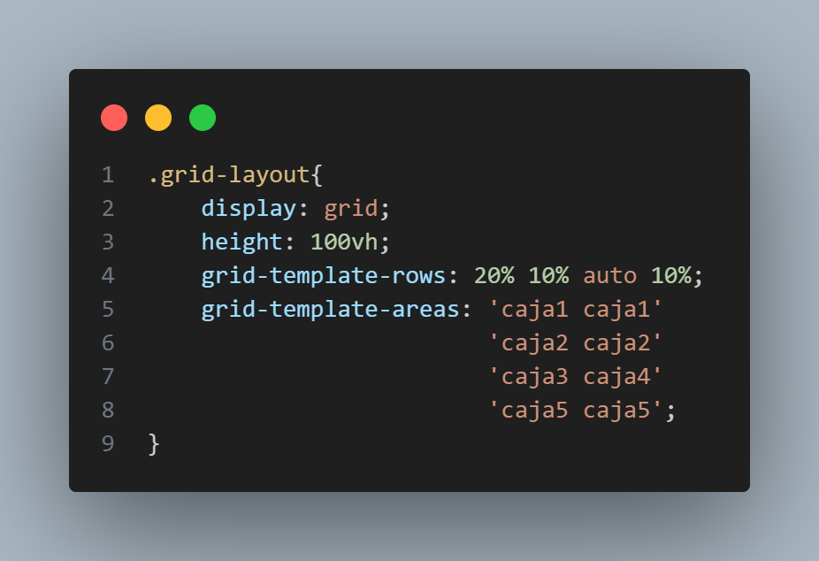

# grid-area
#Aprendiendo a usar grid-template-areas 
La propiedad grid-template-areas permite especificar areas de la cuadricula con nombre, estableciendo las celdas en cuadriculas y asignadole nombres.
Esta propiedad va en el contenedor padre grid. 
Ejemplo
